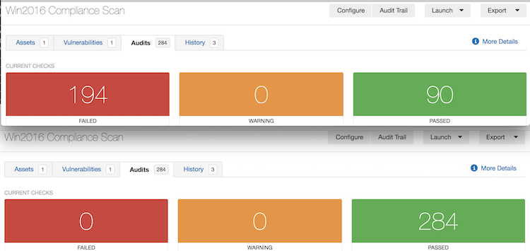

# Baseline

## Description

The __create_baseline_audit.py__ script is used to take the values from a provided __.nessus__ file, and combine them as known_good values in a __.audit__ file.

The example below shows a compliance scan using a CIS benchmark on a Windows 2016 target.  The top results are from the original scan, and the bottom results are from a baseline scan with the audit created from the results of the first scan.



Some things to consider:
- Original audit file should not have known_good values existing in it.
- Best results when used with the same audit file that was used in the first scan, and only one audit file per scan.
- Actual values are not applied to checks that are within the conditional sections of audit if/then/else structures. This was done to maintain consistency with the conditional logic.
- Any checks that use custom commands, such as CMD_EXEC or SQL_POLICY, may have inconsistent or unsupported output.  SQL statements may return values in different orders if not sorted or system commands may output Unicode characters in their output.  If developing checks, consider sorting output where possible into a consistent order and sanitizing any non-ascii characters from the output.
- Values that have both single and double quotes in the value will be placed in known_good fields using double quotes, and escaping the instances of double quotes in the value.  This should support most plugins.
- Checks that use static report items to post a WARNING or FAILED will not be modified by known_good values.

The script was tested using __.nessus__ files exported from Tenable.IO and Nessus Pro.

There are a number of use cases that this could be used for.

- __Baseline Scanning:__ Create a system that represents your baseline against the company auditing policy, and scan this system with the audit file.  Use the script to record the configuration of your Baseline Reference Audit and scan all other systems with the new audit file to compare the configuration against the baseline.  This can identify any systems that may need remediation actions.
- __Change Identification:__ On a single server, create an audit file to monitor the parts of the system that must be monitored for changes, and create your baseline reference audit file by scanning the server with your audit file.  To capture the current state of the server, use the script to create your baseline audit file, and schedule a periodic scan of the server with the new audit file.  In any instance that the scan identifies a failed check, there must have been an actor that made a change to the system.

Some additional information can be found in the [Tips and Tricks](./TIPS_AND_TRICKS.md).

## Operation

### Requirements

- python3 (may work on python2.7+, but didn't test)

### Usage

```
usage: create_baseline_audit.py [-h] [-t] [-v] [-o] [-f FILENAME]
                                [-r REFERENCE]
                                audit nessus

Read audit file and nessus file and create a new baseline audit based on known
good values.

positional arguments:
  audit                 audit files to use as source
  nessus                nessus file to use values from

optional arguments:
  -h, --help            show this help message and exit
  -t, --timestamp       show timestamp on output
  -v, --verbose         show verbose output
  -o, --overwrite       overwrite output file if it exists
  -f FILENAME, --filename FILENAME
                        override filename of output file
  -r REFERENCE, --reference REFERENCE
                        add reference tag to identify deviations
```

Options exist that allow the overwriting of the resulting audit, naming the resulting audit (when only one host is scanned), and providing more verbose output.

The optional `--reference` option will add a reference item to each check that identifies if the check would be compliant with the original audit, deviates from the original audit, or should be reviewed.

### Example Run

```Shell Session
test$ ls
CIS_MS_SERVER_2016_Level_1_v1.0.0.audit	Win2016_Compliance_Scan.nessus		create_baseline_audit.py
test$ ./create_baseline_audit.py -tv CIS_MS_SERVER_2016_Level_1_v1.0.0.audit Win2016_Compliance_Scan.nessus
2018/02/09 08:23:10 Start
2018/02/09 08:23:10 Retrieving values
2018/02/09 08:23:10 Reading Win2016_Compliance_Scan.nessus
2018/02/09 08:23:10 Retrieving values from 192.168.0.42
2018/02/09 08:23:10 Applying values
2018/02/09 08:23:10 Reading CIS_MS_SERVER_2016_Level_1_v1.0.0.audit
2018/02/09 08:23:10 Applying values for 192.168.0.42
2018/02/09 08:23:10 Outputing file
2018/02/09 08:23:10 Writing CIS_MS_SERVER_2016_Level_1_v1.0.0.192.168.0.42.audit
2018/02/09 08:23:10 Done
test$ ls -l CIS_MS_SERVER_2016_Level_1_v1.0.0.*
-rw-r--r--  1 streckc  users  621899 Feb  9 08:23 CIS_MS_SERVER_2016_Level_1_v1.0.0.192.168.0.42.audit
-rw-r--r--  1 streckc  users  609516 Feb  9 07:20 CIS_MS_SERVER_2016_Level_1_v1.0.0.audit
test$
```
